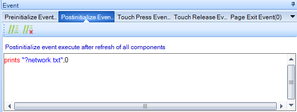

# opi-nextion

This repository is special for the support of the [Nextion HMI Display](https://nextion.tech)'s.

It is currently *work in progress*.

The `lib-nextion` will contain the framework. The idea is similiar as with [remote configuration framework](http://www.orangepi-dmx.org/orange-pi-dmx512-rdm/remote-configuration); there is a defined simple communication protocol.

The directory `opi_emac_artnet_nextion` will contain a dummy Art-Net 4 Node for testing `lib-nextion`.

I invite you to participate in this project:

1. Open an Issue
2. Create a directory in `users`, put in your .tft file and submit a [pull request](https://help.github.com/en/articles/about-pull-requests).

**The protocol**.

* No events must be generated.
* When a page must retrieve data then the '?' must be prefixed to the configuration file name.
* When page data must be stored then the '!' must be prefixed to the configuration file name.
* The startup page, the main page, must just send 'main'

Example main page.
 

Example Network page.
 

 

http://www.orangepi-dmx.org/
