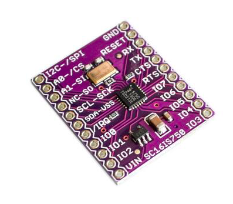

In the OPi firmware framework, the I2C master device is used for user interaction.

As the Nextion display has an UART connection only, the SC16IS7x0 is used for the UART <-> I2C conversion.

[https://www.nxp.com/docs/en/data-sheet/SC16IS740_750_760.pdf?](https://www.nxp.com/docs/en/data-sheet/SC16IS740_750_760.pdf?)

For example a break-out-board:
 
